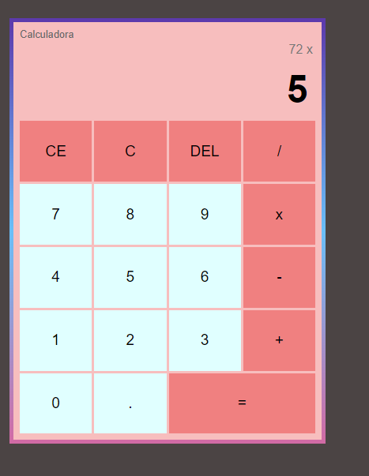

# Calculadora Básica em JavaScript, HTML e CSS

Este é um projeto simples de uma calculadora básica desenvolvida utilizando HTML, CSS e JavaScript. A calculadora permite realizar operações básicas de adição, subtração, multiplicação e divisão.

## Funcionalidades

- Realizar operações de adição, subtração, multiplicação e divisão.
- Limpar o visor da calculadora.
- Exibir resultados precisos.

## Demonstração

## Pré-requisitos

Para utilizar a calculadora, você só precisa de um navegador web moderno que suporte HTML5, CSS3 e JavaScript.

## Como Utilizar

1. Clone ou faça o download deste repositório para o seu computador.
2. Abra o arquivo `calculadora.html` no seu navegador web.
3. A calculadora será exibida na tela, pronta para ser utilizada.
4. Clique nos botões numéricos para inserir os números desejados.
5. Utilize os botões de operação para escolher a operação desejada.
6. Clique no botão "=" para calcular o resultado da operação.
7. Clique no botão "C" para apagar o Numero completo.
8. Clique no botão "CE" para limpar completamente o visor , inclusive operações passadas.
9. Clique no botão "DEL" para apagar o último caractere.
10. O histórico de operações e resultados será mantido na tela.

## Estrutura de Arquivos

- `calculadora.html`: O arquivo HTML que contém a estrutura da página da calculadora.
- `script.js`: O arquivo JavaScript que contém a lógica para realizar os cálculos e operações.
- `style.css`: O arquivo CSS que estiliza a calculadora.

## Personalização

Se você desejar personalizar a aparência da calculadora, você pode modificar o arquivo `style.css` para ajustar as cores, tamanhos e estilos de acordo com as suas preferências.

## Contribuições

Contribuições para melhorias neste projeto são bem-vindas. Se você tiver alguma sugestão ou correção, sinta-se à vontade para criar uma issue ou enviar um pull request.

## Licença

Este projeto está licenciado sob a [Licença MIT](LICENSE), o que significa que você pode utilizá-lo livremente, modificar e distribuir de acordo com os termos da licença.
